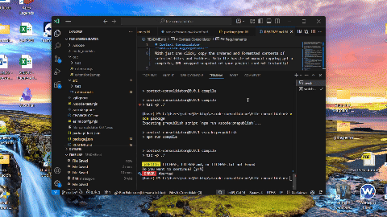

# Context Consolidator

Instantly copy the actual contents of the files you need—no more tedious, manual copying. Context Consolidator lets you gather, format, and copy an ordered snapshot of your project's files with a single click, saving you time and streamlining your workflow.

## Main Benefit

**One-Click Aggregation:**  
With just one click, copy the ordered and formatted contents of selected files and folders. Skip the hassle of manual copying—get a complete, XML-wrapped snapshot of your project context instantly!

## Demo



## Features

- 🤖 **AI-Friendly Aggregation:**  
  Automatically wraps file paths and contents in XML tags for enhanced LLM parsing and analysis.
- 🚀 **Rapid Context Gathering:**  
  Easily select individual files or entire folders in one click.
- 🖱️ **Persistent File List:**  
  Manage your selection seamlessly—add or remove files without closing the menu.
- ⌨️ **Hotkey Support:**  
  Trigger consolidation instantly using the default hotkey `Ctrl+Alt+C` (or `Cmd+Alt+C` on Mac).
- 📊 **Real-Time Tracking:**  
  Monitor the number of files queued for consolidation.
- 🔍 **Detailed Project Snapshot:**  
  Generate a complete XML snapshot that includes file paths and file content.

## How It Works

1. **Select Files/Folders:**  
   - **Right-Click a Folder:** Choose **"Add to consolidated list"** to add a folder.  
   - **Add Folder Contents:** When you add a folder, all files within that folder are automatically added to the list.

2. **Manage Your List:**  
   - Look at the bottom status bar for **"Files to consolidate (n)"**.  
   - Click this status bar item to open the consolidation menu.  
   - In the menu, delete unwanted files by clicking them.

3. **Consolidate with One Click:**  
   - In the menu, click **"Consolidate All"** to instantly copy the complete XML snapshot of your selected files to your clipboard.

### XML Structure Example

```xml
<ConsolidatedFilesContext>
  <FolderTree>
    path/to/file1.ts
    path/to/file2.js
  </FolderTree>
  <Code file="path/to/file1.ts">
    // File 1 content...
  </Code>
  <Code file="path/to/file2.js">
    // File 2 content...
  </Code>
</ConsolidatedFilesContext>
```

## Supported Workflows

- **Efficient Code Review & Debugging:**  
  Quickly share a comprehensive project snapshot for streamlined reviews and debugging.
- **Clear Project Explanations:**  
  Provide context-rich details to assist AI-powered analysis or team discussions.
- **Smooth Architecture Discussions:**  
  Present a complete overview of your project's structure for high-level planning and design talks.

## Requirements

- VS Code 1.96.0 or newer

Happy coding!